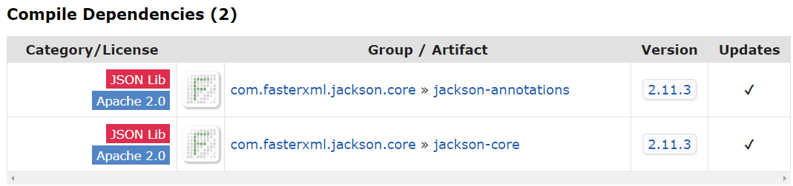
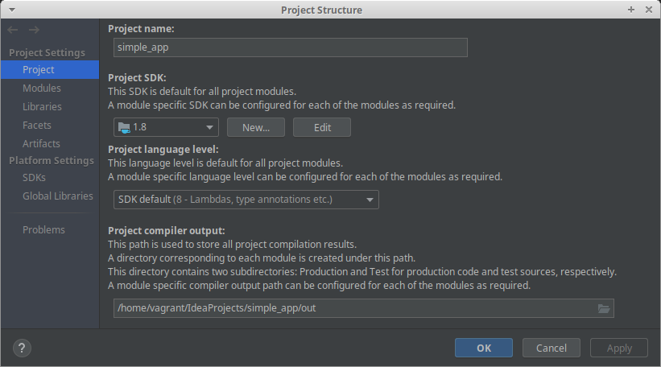
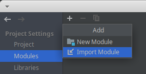
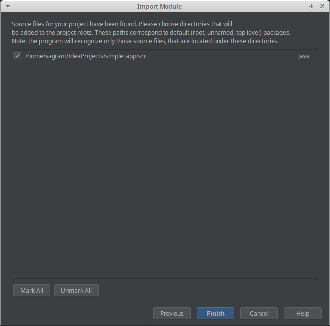
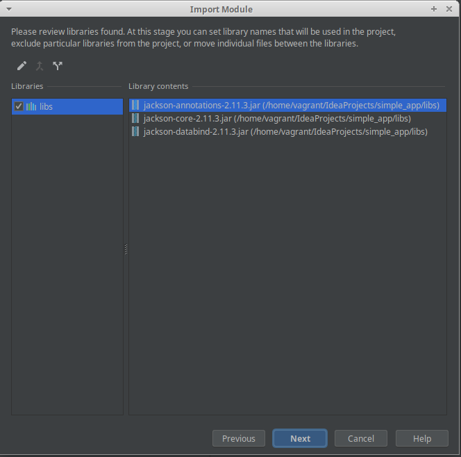
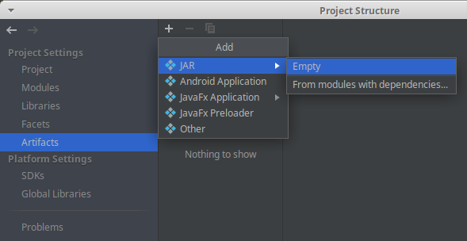
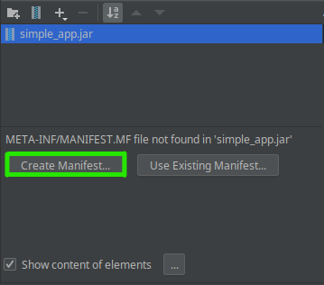
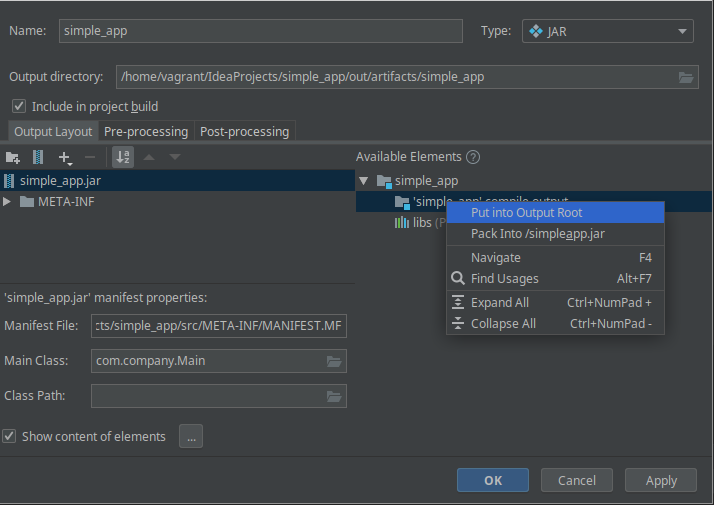
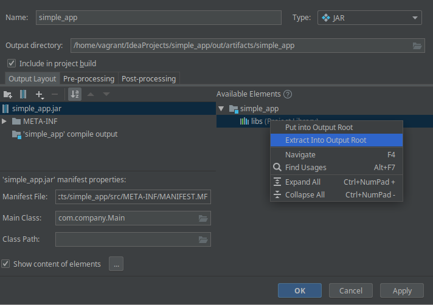
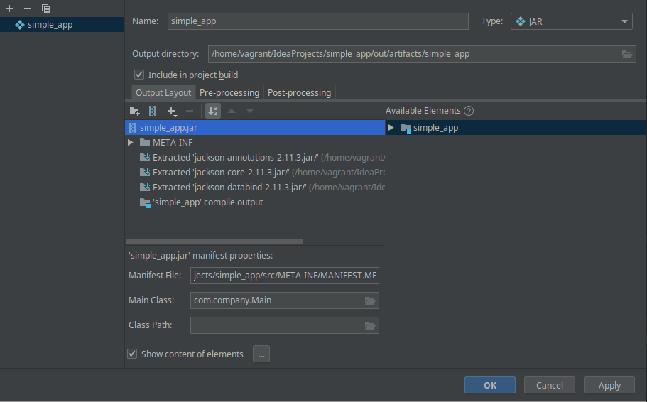

In today's post, I'd like to show you three ways to build an executable JAR file and prove that you don't need to be a magician to create such a file. The reason for this is that the JAR is nothing more than a ZIP file with proper structure, and the extension changed to `.jar`. Actually, you don't even really need to change the extension to `.jar`.

The first way to create an executable JAR is to manually **build the artifact in the terminal**. By presenting this approach, I would like to show how much the building tools and IDE itself make our lives easier.

In the second example, we will use the support provided by the IntelliJ IDE. Generating executable JARs from the IDE is possible and very easy, but not very practical. It is mainly suitable for small projects or one-time creation because IDE settings are not usually committed to the repository. It is also not very useful in case of continuous integration/deployment processes.

The last (recommended) approach is to create an executable JAR with the build tool (e.g. **Maven, Gradle**). This is the best approach as the configuration is committed to the repository, the artifact generation is independent of the IDE, and it is effortless to integrate this process into continuous integration/deployment.

## What Is a Fat, Uber, Executable JAR File?

> _'JAR stands for Java ARchive. It's a file format based on the popular ZIP file format and is used for aggregating many files into one. \[...\] A JAR file is essentially a zip file that contains an optional META-INF directory.' ~ [Oracle (JAR File Specification)][oracle-jar-specs]_

From our point of view, a JAR file is just a bunch of classes that we want to use and a `META-INF` directory which contains a `MANIFEST.MF` file. The file specifies where is our `public static void main(String[] args)` method. Additionally, terms `fat` or `uber` mean that in addition to bytes of our application, we will also include the external libraries that are needed to run the application. In other words, this artifact will have everything you need to run the application on a Java Runtime environment using a `java -jar myApp.jar` command.

If you want to learn more about the different approaches to JAR packaging, I recommend this article: [The Skinny on Fat, Thin, Hollow, and Uber.][jar-types-article].

## About the Application

The application will provide a command-line-interface in which you can enter some data. This data will then be saved to a .json file. What the application does is irrelevant. The only important thing is that it needs a 3rd party to work (Jackson library). The code is available [on GitHub][article-sources-link].

Let's create some simple model class:

```java
package com.company.model;

public class Client {

    private final String name;
    private final String surname;
    private final String email;

    public Client(String name, String surname, String email) {
        this.name = name;
        this.surname = surname;
        this.email = email;
    }

    public String getName() {
        return name;
    }

    public String getSurname() {
        return surname;
    }

    public String getEmail() {
        return email;
    }
}
```

and our main method:

```java
package com.company;

import com.company.model.Client;
import com.fasterxml.jackson.databind.ObjectMapper;

import java.io.File;
import java.io.IOException;
import java.util.Scanner;

public class Main {

    public static void main(String[] args) throws IOException {

        Client client = readClientDataFromCli();

        writeClientToJson(client, "client.json");
    }

    private static Client readClientDataFromCli() {
        Scanner sc = new Scanner(System.in);
        System.out.println("Insert client data.");

        System.out.print("Name: ");
        String name = sc.next();

        System.out.print("Surname: ");
        String surname = sc.next();

        System.out.print("Email: ");
        String email = sc.next();

        return new Client(name, surname, email);
    }

    private static void writeClientToJson(Client client, String fileName) throws IOException {
        File outputFile = new File(fileName);
        outputFile.createNewFile();

        ObjectMapper mapper = new ObjectMapper();
        mapper.writeValue(outputFile, client);
    }
}
```

Now, our IDE is so smart that it allows to run this code straight from the IDE, but let's try to build executable JAR.

## Variant #1 &#8211; Build the Executable JAR Manually in Terminal

In this case, we can close our IDE and do everything from the terminal. First, we need to manually download all the dependencies that we have used in our code. Things can get a little tricky as the dependencies we used may depend on other libraries and those libraries depend on others and so on&#8230;

In our case the only dependency that we have used is [jackson-databind]. In the [mvnrepository.com][mvn-repo] we can see that it needs two other libraries to compile: [jackson-annotations] and [jackson-core]. Luckily, none of them depend on any more libraries. <figure class="wp-block-image size-large is-resized">



Let's put all those dependencies in a separate `libs` directory.

```bash
mkdir libs
cd libs
wget https://repo1.maven.org/maven2/com/fasterxml/jackson/core/jackson-databind/2.11.3/jackson-databind-2.11.3.jar
wget https://repo1.maven.org/maven2/com/fasterxml/jackson/core/jackson-core/2.11.3/jackson-core-2.11.3.jar
wget https://repo1.maven.org/maven2/com/fasterxml/jackson/core/jackson-annotations/2.11.3/jackson-annotations-2.11.3.jar
```

Now, when we have everything in place we can compile our classes. Let's create a separate `compiled` directory for the generated files. Otherwise, the files will be generated alongside the original files. Here you can see how to use the `javac` command:

```bash
mkdir compiled
javac -cp "src/:libs/*" -d compiled src/com/company/Main.java
```

|||
| --------------------------|-----------------------------------------------------------|
| `javac`                   | Reads Java class and interface definitions and compiles them into bytecode and class files.|
| `-cp`<br/>`[-classpath]`  | Specifies where to find user class files, and (optionally) annotation processors and source files.|
| `-d`<br/>`[-directory]`   | Sets the destination directory for class files. <br/>The directory must already exist because javac does not create it.|


In our example, we would like to make a so-called fat/uber JAR. This means that all sources (including 3rd party) needed to run the application will be in this file. It is very convenient, but it is not without its drawbacks. If we had several applications that use the same dependencies, making a fat jar for each of them would unnecessarily duplicate those libraries. Therefore usually only application sources are packed into a JAR and external ones are linked using `classpath`.

Since JAR is based on a zip, it can be unpacked in many ways, for example with `unzip`, `tar` or `jar` commands. Let's use commands below. There will be some conflicts regarding the `META-INF` directory and a `module-info.class` file, but we only care about the `com` directory. You can delete the rest.

```bash
cd libs
unzip "*.jar" -d ../compiled/
```

Our `compiled` directory finally contains everything we need to create the executable fat JAR file. You can do this by running a command:

```bash
cd compiled
jar -cfe app.jar com.company.Main com/
```


The `jar` command works the same as `zip`. The only difference is that if we give it a parameter, which is the location of the main class (`com.company.Main`), it will automatically generate a manifest. Instead of running the above command, you could create the META-INF/MANIFEST.MF file manually and just zip content of a `compiled` directory. Such a `.zip` file can also be run with the command below, even without changing the extension to `.jar`. 

Now you should be able to run the application:

```bash
java -jar compiled/app.jar
```


## Variant #2 &#8211; Build the Uber JAR With Intellij IDE Support

Generating artifacts from IDE is simple and much more convenient than doing it manually. Unfortunately, if we wanted to share the created configuration with other team members, they would have to use the same IDE or configure everything on their own. The build process should be implemented in such a way that it is completely independent of the IDE used. This method is rather suitable for small projects run by one developer, or for some temporary configuration.

All the necessary steps only require clicking on a few options. First, run the `Project Structure` window. Use top menu (`File -> Project Structure)`, or a shortcut `Ctrl + Alt + Shift + S`. 




IntelliJ will usually detect the java module itself, but if it doesn't, go to the `Modules` tab and add one yourself by clicking `+` and `Import Module`. Then choose the root directory of the project, in my case it is `simple_app`.








Then go to the `Artifacts` tab and create a new JAR artifact (empty) and set its name.












Now, build a project. You can do it by: 

  * running `Build -> Build Project` from the top menu
  * using a hammer in the toolbar
  * using a shortcut `Ctrl + F9`

You should see a new directory, which includes our JAR. You can run it the same way as previosuly:

```bash
java -jar simple_app.jar
```

We obtained exactly the same effect as before, this time using the support of our IDE.

## Variant #3 &#8211; Build the Fat JAR With Maven and Gradle

Previous approaches required us to download dependencies ourselves, which is not the most interesting activity. Maven and Gradle take this burden off us and take care of collecting all dependencies themselves. Of course, you can take advantage of Gradle's/Maven's dependency management and still generate artifact using your IDE without the need of downloading dependencies manually. This process is very similar to what I showed in variant 2, and I think you will be able to figure it out for yourself. 

I will not explain here how build-tools work. 
I will only show a configuration snippet that will allow you to generate an executable JAR. 
In the highlighted fragments it is enough to set the `Main-Class` parameter. 
The build tool will do the rest.

```java
plugins {
    id 'java'
}

group 'com.company'
version '1.0-SNAPSHOT'

sourceCompatibility = 1.8

repositories {
    mavenCentral()
}

dependencies {
    compile group: 'com.fasterxml.jackson.core', name: 'jackson-databind', version: '2.11.3'
}

jar {
    manifest {
        attributes "Main-Class": "com.company.Main"
    }

    from {
        configurations.compile.collect { it.isDirectory() ? it : zipTree(it) }
    }
}
```


```xml
<?xml version="1.0" encoding="UTF-8"?>

<project xmlns="http://maven.apache.org/POM/4.0.0" xmlns:xsi="http://www.w3.org/2001/XMLSchema-instance"
         xsi:schemaLocation="http://maven.apache.org/POM/4.0.0 http://maven.apache.org/xsd/maven-4.0.0.xsd">
    <modelVersion>4.0.0</modelVersion>

    <groupId>com.company</groupId>
    <artifactId>simple_app</artifactId>
    <version>1.0-SNAPSHOT</version>

    <properties>
        <project.build.sourceEncoding>UTF-8</project.build.sourceEncoding>
        <maven.compiler.source>1.8</maven.compiler.source>
        <maven.compiler.target>1.8</maven.compiler.target>
    </properties>

    <dependencies>

        <dependency>
            <groupId>com.fasterxml.jackson.core</groupId>
            <artifactId>jackson-databind</artifactId>
            <version>2.11.3</version>
        </dependency>

    </dependencies>

    <build>
        <plugins>
            <plugin>
                <groupId>org.apache.maven.plugins</groupId>
                <artifactId>maven-shade-plugin</artifactId>
                <version>3.2.4</version>
                <executions>
                    <execution>
                        <phase>package</phase>
                        <goals>
                            <goal>shade</goal>
                        </goals>
                        <configuration>
                            <transformers>
                                <transformer implementation="org.apache.maven.plugins.shade.resource.ManifestResourceTransformer">
                                    <mainClass>com.company.Main</mainClass>
                                </transformer>
                            </transformers>
                        </configuration>
                    </execution>
                </executions>
            </plugin>
        </plugins>
    </build>
</project>
```

Of course, many other techniques and plugins can be used to create a fat JAR with Maven and Gradle, because it is just a ZIP archive. The JAR file can be created by any way that allows you to create a ZIP archive. You just need to change its extension and keep the file structure (`MANIFEST.MF`) that will be understood by Java Runtime. 

## Summary

In this post, I showed you three ways to create an executable JAR file: manually, using IDE and using build tools (Maven and Gradle). I also proved that the JAR is nothing more than a ZIP file with some specific structure inside. The code is available <a href="https://github.com/kkdrz/fat-jar-examples" target="_blank" rel="noreferrer noopener">on GitHub</a>.


[oracle-jar-specs]: https://docs.oracle.com/javase/8/docs/technotes/guides/jar/jar.html
[jar-types-article]: https://dzone.com/articles/the-skinny-on-fat-thin-hollow-and-uber
[article-sources-link]: https://github.com/kkdrz/fat-jar-examples

[mvn-repo]: https://mvnrepository.com/
[jackson-annotations]: https://mvnrepository.com/artifact/com.fasterxml.jackson.core/jackson-annotations
[jackson-core]: https://mvnrepository.com/artifact/com.fasterxml.jackson.core/jackson-core
[jackson-databind]: https://mvnrepository.com/artifact/com.fasterxml.jackson.core/jackson-databind/2.11.3