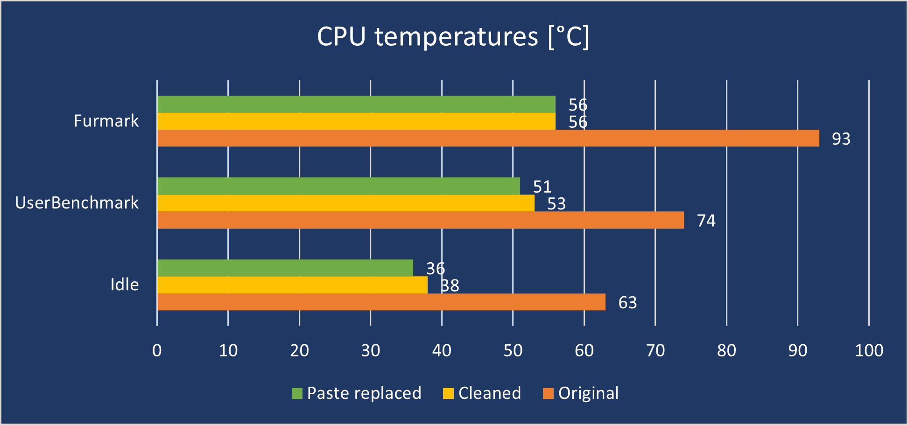
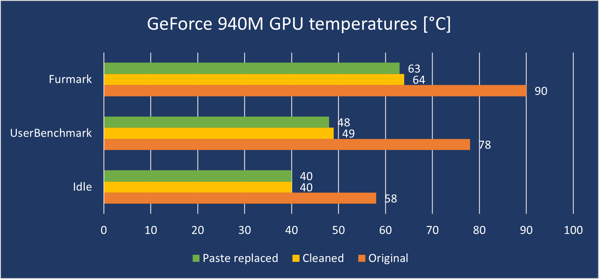
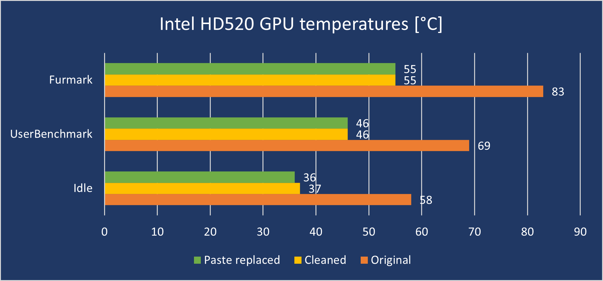
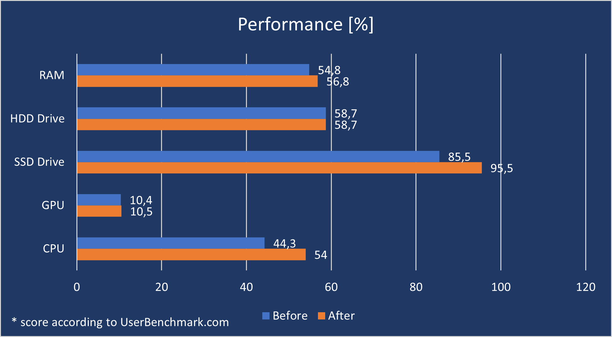

[HWiNFO]: https://www.hwinfo.com/
[FurMark]: https://geeks3d.com/furmark/
[UserBenchmark]: https://www.userbenchmark.com/
[UserBenchmark-FAQ]: https://www.userbenchmark.com/Faq/What-is-UBM-Effective-Speed/95
[making-the-best-of-an-old-crappy-computer]: /making-the-best-of-an-old-crappy-computer

The purpose of this short article is to remind you how important it is to clean your electronic equipment regularly. At least I forgot about it...

5 years ago I bought a laptop for a college. I cleaned it from the outside at least once a week, but inside... I think I only cleaned it once while installing the SSD drive (about 3 years ago). Then I found a job and started doing most of the things on my work computer. I hardly play games (at most once a month), so I started using my laptop so rarely that I didn't notice high temperatures and performance drop.

Recently I was [improving my parents' computer][making-the-best-of-an-old-crappy-computer] and I thought that since I bought a thermal compound, I will also replace it on my laptop. But it wasn't the paste that was the game changer!

## Objective

I was curious about **what will have a greater impact on the temperature drop: cleaning or thermal paste replacement**. To find out, I checked the temperatures of the equipment and ran benchmark before disassembling it, after cleaning it, and after changing the paste. 

Unfortunately, I lost the performance results between cleaning and paste replacement somewhere, but I think it doesn't matter much. The scale of changes is perfectly reflected in the measured temperatures.

## Software used

To set the laptop on fire, I ran a [FurMark]. The application heated the components until the temperature stabilized (about 10 minutes). 

[UserBenchmark] was used to conduct the benchmark (duh). The charts show only the overall score that was calculated by the application. It is described as _'Real-world speed relative to the best alternatives'_. If you are interested in how it is counted, please see [the FAQ page][UserBenchmark-FAQ].

[HWiNFO] logged the maximum temperatures.

## Results

The graphs show the maximum temperatures under 3 different loads: maximum (FurMark until the temperature stabilized ~10 minutes), during benchmarking and when the laptop was idle for 5 minutes.

## Summary

It turns out that I may not have changed the thermal compound at all. **Temperature drops after cleaning were huge (-37°C for CPU), while the replacement of the paste didn't give more than 2°C.** To be honest, I was expecting similar results, but I didn't think the difference in temperature after cleaning would be that significant. After disassembling the laptop, practically no dust was visible. Unfortunately, I didn't think to take a picture before cleaning, but you have to take my word for it. If someone showed me the laptop in this condition and asked if this amount of dust could affect temperatures that much, I would say: _rather not_.

Thanks to the temperatures drop, **the laptop also achieved better performance results**. Particular improvement is seen in processor performance. Before cleaning, it reached a temperature of 93°C, which caused throttling. **Throttling** in simple words means that the CPU detected too high temperature and tried to save itself from baking by reducing clock speed.

As you can see it was a good idea to finally clean the computer. I will definitely pay more attention to that in the future 🙂