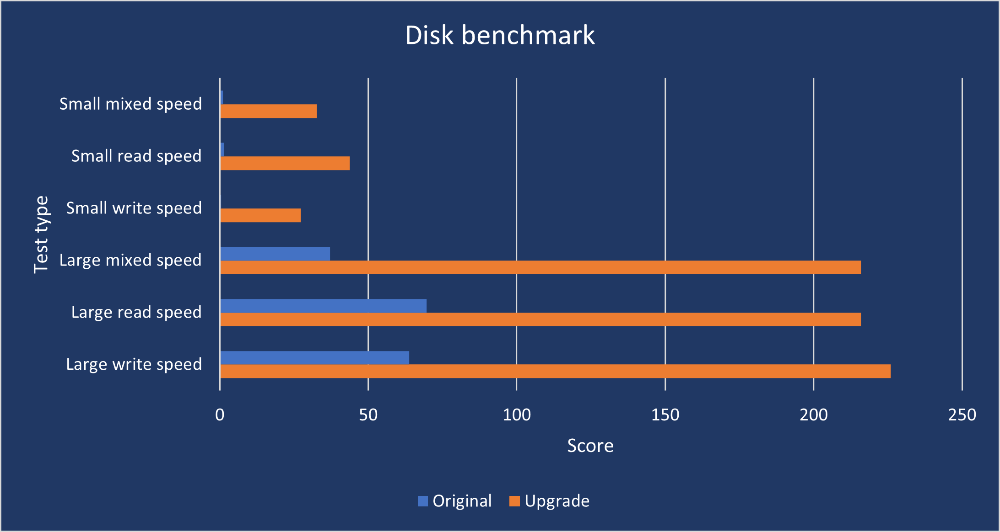

[lga-771-to-775-adapter]: https://www.delidded.com/lga-771-to-775-adapter/2/
[e5450-aliexpress]: https://www.aliexpress.com/item/32332257819.html
[2gb-ram-aliexpress]: https://www.aliexpress.com/item/32893259337.html?spm=a2g0s.9042311.0.0.40844c4dXXRRtl
[gtx770-specs]: https://www.techpowerup.com/gpu-specs/geforce-gtx-770.c1856

In my parents' house, there is my (and my little brother's 😉) good, old desktop computer. Theoretically, this is not my first PC, but in practice, I spent the most time with it and it was the first computer with internet access. The configuration was pretty good at the time (2009):

|               |                                                                                  |
| ------------- | -------------------------------------------------------------------------------- |
| CPU           | Intel Core 2 Duo E6400 *2M Cache, 2.13 GHz, 1066 MHz FSB*                     |
| Motherboard   | Gigabyte GA-EP43-DS3L                                                            |
| Graphics card | Radeon HD 4850 512MB  (_broken after 7 years and replaced with: GTS 450 1GB_) |
| RAM           | 2 x 2GB DDR2 800Mhz                                                              |
| Hard drive    | Seagate Barracuda 1TB (HDD)                                                      |

I don't remember having a problem with launching any new game for the next few years. But now, after 11 years, this configuration is not the most recent and my parents (current users) began to complain about performance. And if they are complaining it must be really bad. The delays are noticeable even when working with the browser (not to mention an eternal startup time).

## SSD Drive

Of course, the first thing that comes to mind is **installing the system on an SSD drive** and leaving the HDD for an additional backup. 'Additional', because I suppose this disk will not live long. I decided to buy a 500GB SSD drive &#8211; **Crucial MX500**. It is compatible with SATA III, but our motherboard supports only SATA II, so its full potential will not be used (but it should provide a significant speed improvement anyway). Currently, its normal price is around $66, but you can find it at a discount for as much as $59. The times have finally come when SSD is not a luxury but a standard. Even 250GB should be enough for my parents, but I took the bigger drive just in case.

## CPU

Since the computer is quite old, I concluded that people probably give away parts like the processor or the RAM for free. It's not that good, but the prices are not high so out of curiosity I decided to **replace the CPU** with a better one. My motherboard supports LGA-775 socket. I found a page with supported processors and the best quad-core units would be: QX9770, QX9650, Q9650, Q9550. Unfortunately, they are not as cheap as I thought. You'll pay around $82 for Q*\*\\*\* units and even $190 (!) for pre-owned QX\*\*\*\* units.

I'd rather not spend so much money on a pig in a poke, so I found quite an interesting alternative solution. There are many Xeon CPUs on the LGA-771 socket on the market, which are very cheap. It turned out that these processors can work on LGA-775 socket after reprogramming the BIOS and adapting the socket.

[How to run LGA 771 Xeon on a LGA 775 motherboard? LGA 771 to 775 Adapter instructions here!][lga-771-to-775-adapter]

The most recommended and most accessible unit &#8211;[**Xeon E5450**][e5450-aliexpress]&#8211; costs only $17 and is already adapted (by friends from China) to the LGA-775 socket. So the only thing I need to do is to update the CPU microcode in a BIOS. I probably won't be able to stop myself from overclocking it either 🙂

## RAM

Another thing that can be easily improved is RAM. In my opinion, nowadays 8GB is the absolute minimum for any type of work, and 16GB should be enough for games for a few years. Parents don't play games, besides, this computer only allows older games so 8GB should be perfect. Anyway, I checked how much it would cost to add 2x4GB. The answer is: TOO MUCH.

I was surprised again because I thought people were throwing DDR2 RAM away or giving it for free. It turns out that a new DDR3 standard was already available when the production of DDR2 4GB modules began. So people who were building new computers immediately switched to the DDR3 platform, and the 4GB modules were mainly bought by those who wanted to improve their DDR2 PC. Currently, there is no DDR2 production, so there is a limited number of modules on the market. There are still quite a lot of computers based on DDR2, so 4GB DDR2 modules cost the same (or more) than 4GB DDR4 (!).

Luckily, the stores are full of [cheap 2GB modules][2gb-ram-aliexpress] that cost $5. I was a bit afraid that the new modules, despite similar specifications, would not be compatible with the current memory, so just in case I took 4 modules. We'll see what comes out.

## Graphics Card

I could also replace the graphics card with a [GTX 770][gtx770-specs] (or a different one), but I figured it didn't make sense and was too risky. The new card is too expensive ($325) and the used one ($80-$110) may have been heavily exploited (and actually it's too expensive too). Therefore the current card (GTS 450) must suffice.

## Results

Final configuration looks like this:

|               |                                                                |
|---------------|----------------------------------------------------------------|
| CPU           | Intel® Xeon® Processor E5450   *12M Cache, 3.00 GHz, 1333 MHz FSB* |
| Motherboard   | Gigabyte GA-EP43-DS3L                                          |
| Graphics card | GTS 450 1GB                                                    |
| RAM           | 8Gb (4x2GB) DDR2 800Mhz                                        |
| Hard drive    | Crucial MX500 500GB (SSD) + Seagate Barracuda 1TB (HDD)        |
            

For now, I am waiting for the delivery of the components. A long journey ahead of them (from China to Poland), so I will probably wait another month. When everything arrives, I will do a benchmark and present results 🙂

## One month later

I received all the components within two weeks. Unfortunately, due to poor cooling, there was no point in overclocking the processor. Temperatures were too high and throttling was taking place. Otherwise, everything went as planned without any technical problems. The LGA-771 to LGA-775 adapter did not cause any problems either. Below you can see the results of the benchmarks.

From my own feelings, I must admit that I did not expect such an improvement in performance. The computer works without any lags. It boots up and runs as fast as my 12 years younger laptop. I've also noticed a significant improvement in games. Previously, Cities Skylines were unplayable due to the low FPS (~10). I didn't measure the exact FPS after the upgrade, but I didn't feel any lags and the game works like a charm.

Below is a table with the total cost of the upgrade.

|                                    |           |
|------------------------------------|-----------|
| Intel® Xeon® Processor E5450       | $17       |
| RAM 4 x 2GB DDR2                   | $17,5     |
| SSD Crucial MX500 500GB            | $67       |
| Thermal Compound Arctic MX-2       | $6,7      |
| **Total:**                         | $108,2    |
