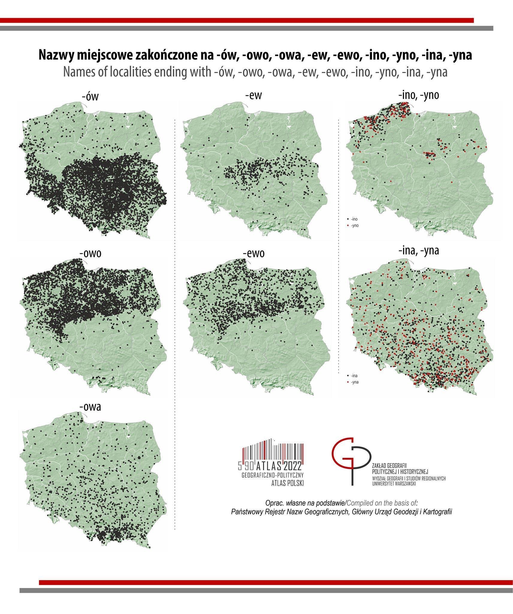
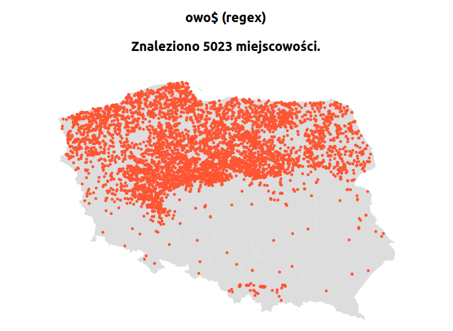
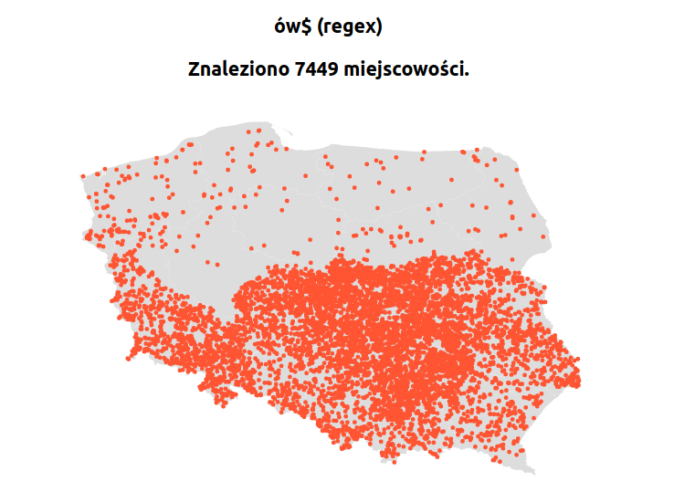
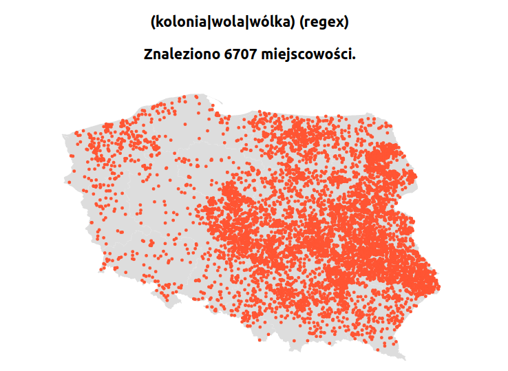

[github]: https://github.com/kkdrz/matching-localities-map
[NRGN]: https://www.geoportal.gov.pl/dane/panstwowy-rejestr-nazw-geograficznych
[react-simple-maps]: https://github.com/zcreativelabs/react-simple-maps
[GADM]:https://gadm.org/download_country_v3.html
[mapshaper]: https://mapshaper.org/
[topojson-tut]: https://hackernoon.com/how-to-convert-and-prepare-topojson-files-for-interactive-mapping-with-d3-499cf0ced5f
[create-react-app]: https://github.com/facebook/create-react-app
[gh-pages-app-link]: kkdrz.github.io/matching-localities-map

Recently, interesting maps of Poland have been circulating on the Internet showing the occurrence of localities ending with various phrases (I have placed it below).
It inspired me to make a simple application that is able to generate such maps based on a given pattern.

If you want to go directly to the meat you can find the code [on my github][github] and the application is avaialble at [kdrozd.pl/matching-localities-map](https://kdrozd.pl/matching-localities-map).



## Planning

I thought for a long time whether to make a serious frontend and backend project out of it, but in the end I came to the conclusion that it didn't make sense.

1. I wanted to **do it as quickly as possible** to catch the current interest of people in this topic.
2. This app is meant to be just **an interesting toy** and I don't expect anyone to use it for more than 5 minutes.
3. I wanted to **deploy it for free**.

That's why I decided that it will be an application written in **React** that processes data **on the client's side**.


## The data

So without over-engineering, I started by searching for the data. 
I needed the localities names and their coordinates.

### How about Google?

At the beginning I thought to base this project on Google Maps Platform, 
but from what I understood they are not free and I think I couldn't get that much data from them.
I would prefer to have all the data in a file, instead of sending Google Maps queries on the fly 
and [the terms of the Google Maps service](https://cloud.google.com/maps-platform/terms/#3.-license.) prohibit such practices.

> 3.2.3 Restrictions Against Misusing the Services.
>
>(a) No Scraping.
> [...]
>
>(b) No Caching.
> [...]
>
>(c) No Creating Content From Google Maps Content
> [...]
>
>(e) No Use With Non-Google Maps
> [...]


On the original maps, I noticed a note from where the author took the data and it turned out to be the best source.
On the [National Register of Geographical Names][NRGN] website I found an `xlsx` file from which I exported three columns to a JSON file: `locality name`, `longitude`, `latitude`. The NRGN regulations state that this data is publicly available, not limited by any restrictions.

So I got something like:

```json
[
  {
    "name": "Adamek",
    "X": 51.0708333333333,
    "Y": 20.5063888888889
  },
  {
    "name": "Adamierz",
    "X": 52.1525,
    "Y": 17.7952777777778
  },
  {
    "name": "Adamin",
    "X": 52.1636111111111,
    "Y": 18.835
  },
  {
    "name": "Adaminowo",
    "X": 52.595,
    "Y": 19.2719444444444
  },
  {
    "name": "Adaminów",
    "X": 51.5766666666667,
    "Y": 21.1330555555556
  },
  {
    "name": "Adamka",
    "X": 53.1483333333333,
    "Y": 21.6527777777778
  }
//   ...
]
```

## Map component library

As for the map display component, I didn't search long. 
One of the first libraries I found was [react-simple-maps][react-simple-maps] and it met all my requirements.

1. It can only display part of the whole world (Poland).
2. You can put markers on it.
3. It's opensource (MIT license).

In order to use this library I had to find a file describing the shape of Poland (shapefile).
I found a suggestion from the authors of the library to use the data from [the GADM site][GADM].
Their map models are freely available for academic use and other non-commercial use.

All I had to do was convert the map data to TopoJSON format. 
To do this I used the online service - [mapshaper][mapshaper]. 
You can find a detailed tutorial [here][topojson-tut].

## Putting it all together

I started creating the application with [create-react-app][create-react-app], added libraries and implemented the whole thing.
It makes no sense for me to describe it in detail because it is very simple.

You can find the source code [on my github][github].

The last step was to automate the deployment. For this I used GitHub Actions.
The workflow looks like this:

```yaml
name: Deploy

on:
  push:
# Run the workflow on each push to 'master' branch
    branches: [ master ]

# Allows to run this workflow manually from the Actions tab
  workflow_dispatch:

jobs:
  deploy:
    runs-on: ubuntu-latest
    steps:
      
    # checkout the code
      - uses: actions/checkout@v2
      
    # install nodejs
      - uses: actions/setup-node@v2
        with:
          node-version: '15'
          
    # npm clean install
      - run: npm ci

    # generate the static sources
      - run: npm run build

      - name: Cache dependencies
        uses: actions/cache@v2
        with:
          path: ~/.npm
          key: ${{ runner.os }}-node-${{ hashFiles('**/package-lock.json') }}
          restore-keys: |
            ${{ runner.os }}-node-

    # push the sources from './build' directory to 'gh-pages' branch 
      - name: Deploy
        uses: peaceiris/actions-gh-pages@v3.7.3
        with:
          github_token: ${{ secrets.GITHUB_TOKEN }}
          publish_dir: ./build
          publish_branch: gh-pages
```

Thanks to this, after each push, the latest version of the app is always available at: [kkdrz.github.io/matching-localities-map](kkdrz.github.io/matching-localities-map).
GitHub Pages allows you to link your own domain. This is exactly how my entire blog works. 
Everything you see is hosted by GitHub (for free). 
As a result of this configuration, the application is also immediately available at: [kdrozd.pl/matching-localities-map](kdrozd.pl/matching-localities-map).

If I got you interested in GitHub Pages, [check it out here](https://pages.github.com/). It's truly awesome!

## Some examples from the app

Let's try to regenerate some of the maps that inspired me to create this application.

### ów vs. owo

It was clear on the original map that locations ending with `-owo` are in the northern part of the country and those ending with `-ów` in the southern part.
To check it in my application, it is not enough to enter patterns `owo` and `ów`, because then it will also find places, not only ending with these, but also containing them in the middle, e.g. *Biał**OWO**da*.

We need to apply a regular expressions: `ów$` and `owo$`. `$` means the end of a line.






As you can see, it turned out the same in my application (strange to find out otherwise, since it is based on the same data).

### kolonia & wola & wólka

When I invited my girlfriend to my hometown (eastern part of Poland), she was surprised that many places contain the words: `kolonia`, `wola` and `wólka`.
Some examples are: `Nowa Wola`, `Wólka Rokicka`, `Kolonia Ciechanki`, `Wola Uhruska`...

Let's check if there are actually more such localities in the east. 
To do this, we will use the regular expression again. 
This time it looks like this: `(kolonia|wola|wólka)`, which literally means: the name contains `kolonia` or `wola` or `wólka`.

If we would like to find places that **start with these words**, a small modification is enough: `^(kolonia|wola|wólka)`. 
`^` means start of the line.

If you want to learn regular expressions (which I really recommend) check out this page: [regexr.com](https://regexr.com/).



As you can see my girlfriend was right :)

#### How to check locality name?

Just click the dot that interests you and the name of the locality will appear in the top-right corner ;)

## Summary

In this post I more or less described the process of creating my simple application for marking localities matching a pattern on a map.
I realize that the application is not super beautiful and you could improve it and add a lot of new features to it, but this version is enough for me.

Feel free to fork it and modify it to your liking. I would love to see your version and some interesting maps! ;)

I remind you once again that the code is available [on github][github] and the application is deployed at [kdrozd.pl/matching-localities-map](https://kdrozd.pl/matching-localities-map).