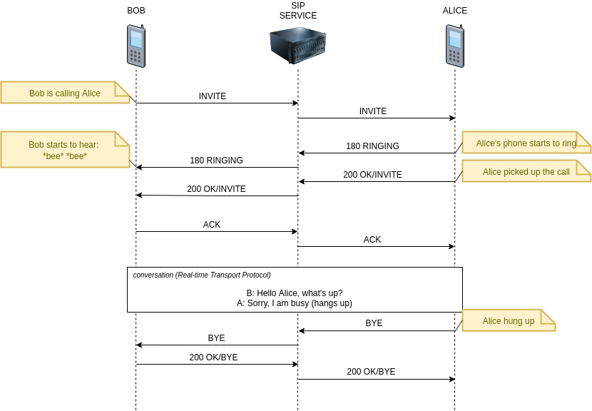

[netty]: https://netty.io/
[SIP]: https://en.wikipedia.org/wiki/Session_Initiation_Protocol
[sipstack]: https://www.sipstack.io/getstarted/
[github]: https://github.com/kkdrz/blog-examples/tree/main/sip-proxy-with-netty

In this post I will show you how to make a simple proxy server for SIP protocol.
Recently I spent some time with [netty] and decided to create some simple application to solidify my knowledge.
I will use the [sipstack] library as a support for the SIP protocol (decoding, encoding...).
Actually, the protocol that I've used doesn't matter so much, but web is full of HTTP proxies tutorials and I wanted to bring something new.

As always, you will find the final code [on my github](github).
 
## But why SIP? What is it anyway?

[SIP] stands for *Session Initiation Protocol*. 
In simple words, this protocol is used to set up sessions between clients, 
for example in IP telephony ([Voice over Internet Protocol](https://en.wikipedia.org/wiki/Voice_over_IP)).
This is the protocol that we use when writing [value-added-services](https://en.wikipedia.org/wiki/Value-added_service) in my current job.
An extremely simplified diagram of how this protocol works looks like this:



I chose this protocol in order to expand my competences. 
Perhaps, in addition to learning, this playground will be useful for something at work :)

## Objective

The application will work exactly as shown in the diagram above. 
Messages will be sent without making any changes to them. This will be a so-called [stateless proxy](https://www.tutorialspoint.com/session_initiation_protocol/session_initiation_protocol_proxies_and_routing.htm).

> Stateless proxies forget about the SIP request once it has been forwarded. This kind of server does not store any information of the call or transaction.

Information about who is the addressee of the message will be included in the `Route` header.

**Technologies used:**

||
|-----------------|
|[Netty][netty]|
|[SipStack](https://www.sipstack.io/getstarted/)|
|[SIPp](https://github.com/SIPp/sipp) (for functional testing)|
|[Kotlin](https://kotlinlang.org/) (as part of learning 😊) |
|[Gradle](https://gradle.org/)|

## Project setup

I started from generating a *hello-world* template using IntelliJ and added the necessary dependencies:

```gradle
dependencies {
//    SIP support
    implementation("io.sipstack:sipstack-netty-codec-sip:0.1.1")
    
//    logging
    implementation("org.slf4j:slf4j-api:1.7.30")
    implementation("ch.qos.logback:logback-classic:1.2.3")
    implementation("ch.qos.logback:logback-core:1.2.3")
}
```

## Set up netty server

Then I created a main class `ProxyApp` that runs the netty server.

In the code I took the following nomenclature:
- `upstream` - this is where the messages originally come (Bob)
- `downstream` - this is where the messages are proxied (Alice)

```kotlin
package pl.kdrozd.examples.sipproxy

import io.netty.bootstrap.ServerBootstrap
import io.netty.channel.Channel
import io.netty.channel.ChannelInitializer
import io.netty.channel.nio.NioEventLoopGroup
import io.netty.channel.socket.nio.NioServerSocketChannel
import io.sipstack.netty.codec.sip.SipMessageEncoder
import io.sipstack.netty.codec.sip.SipMessageStreamDecoder
import org.slf4j.LoggerFactory
import java.net.InetSocketAddress

class ProxyApp(private val hostname: String, private val port: Int) {

    private var upstreamChannel: Channel? = null

    fun start() {
        val workGroup = NioEventLoopGroup()
        val bossGroup = NioEventLoopGroup()
        val b = ServerBootstrap()
        b.group(bossGroup, workGroup)
            .channel(NioServerSocketChannel::class.java)
            .childHandler(object : ChannelInitializer<Channel>() {
                override fun initChannel(ch: Channel) {
                    with(ch.pipeline()) {
                        addLast("decoder", SipMessageStreamDecoder())
                        addLast("encoder", SipMessageEncoder())
                    }
                }
            })
        val socketAddress = InetSocketAddress(hostname, port)
        val f = b.bind(socketAddress).sync()
        upstreamChannel = f.channel()
    }

    fun stop() {
        if (upstreamChannel?.isActive == true) {
            upstreamChannel?.close()?.await()
        }
    }

}
```

This class is not very interesting and looks like most of the other classes that bootstrap netty.
We use `NioServerSocketChannel`, because we want to use `TCP` protocol. 
In the case of `UDP`, we would use `NioDatagramChannel`.
If you need more explanation of what's going on here, check out [the netty documentation](https://netty.io/wiki/user-guide-for-4.x.html#writing-a-discard-server). 

The most interesting part is setting up the message decoder/encoder:

```kotlin
b.group(bossGroup, workGroup)
            .channel(NioServerSocketChannel::class.java)
            .childHandler(object : ChannelInitializer<Channel>() {
                override fun initChannel(ch: Channel) {
                    with(ch.pipeline()) {
                        addLast("decoder", SipMessageStreamDecoder())
                        addLast("encoder", SipMessageEncoder())
                    }
                }
            })
```

`SipMessageStreamDecoder` is the decoder for the incoming data. It decodes bytes to `SipMessageEvent` and works for stream based protocols (TCP).
If you want to use datagram based protocols (UDP), there is an alternative: `SipMessageDatagramDecoder`.

`SipMessageEncoder` encodes `SipMessageEvent` back to bytes. It is used for both TCP and UDP.

With a simple `main` method we can run the service:

```kotlin
package pl.kdrozd.examples.sipproxy

fun main() {
    val app = ProxyApp("127.0.0.1", 5060)
    app.start()
}
```

## Create handlers

After startup, our server is able to accept messages, 
but we haven't added any message handler to the pipeline, so it doesn't do anything with them.

Below is the **`ProxyUpstreamHandler`** implementation. 
This is the handler responsible for receiving messages from `upstream`, creating connection with `downstream` and proxying the messages.

```kotlin
package pl.kdrozd.examples.sipproxy

import io.netty.bootstrap.Bootstrap
import io.netty.buffer.Unpooled
import io.netty.channel.*
import io.netty.channel.socket.nio.NioSocketChannel
import io.pkts.packet.sip.SipMessage
import io.pkts.packet.sip.address.SipURI
import io.sipstack.netty.codec.sip.SipMessageEncoder
import io.sipstack.netty.codec.sip.SipMessageEvent
import io.sipstack.netty.codec.sip.SipMessageStreamDecoder
import org.slf4j.LoggerFactory

class ProxyUpstreamHandler : SimpleChannelInboundHandler<SipMessageEvent>() { // 1

    private var downstreamChannel: Channel? = null

    override fun channelRead0( // 2
        ctx: ChannelHandlerContext,
        event: SipMessageEvent
    ) {
        val msg = event.message
        val upstreamChannel: Channel = ctx.channel()

        val f: ChannelFuture = connectWithDownstream(upstreamChannel, msg) // 3

        f.addListener(ChannelFutureListener { connectionCompleteFuture: ChannelFuture -> // 4
            if (!connectionCompleteFuture.isSuccess) {
                closeAndFlush(upstreamChannel)
            }

            downstreamChannel = connectionCompleteFuture.channel()
            proxyMessageToDownstream(ctx, msg)
        })
    }

    private fun connectWithDownstream(
        upstreamChannel: Channel,
        msg: SipMessage
    ): ChannelFuture {
        val b = Bootstrap()
        b.group(upstreamChannel.eventLoop())
            .channel(NioSocketChannel::class.java)
            .handler(object : ChannelInitializer<Channel>() {
                override fun initChannel(ch: Channel) {
                    with(ch.pipeline()) {
                        addLast("decoder", SipMessageStreamDecoder())
                        addLast("encoder", SipMessageEncoder())
                        addLast("handler", ProxyDownstreamHandler(upstreamChannel)) // 5
                    }
                }
            })
        val routeHeader = msg.routeHeader.address.uri as SipURI // 6
        return b.connect(routeHeader.host.toString(), routeHeader.port) // 7
    }

    private fun proxyMessageToDownstream(ctx: ChannelHandlerContext, msg: SipMessage) {
        downstreamChannel?.writeAndFlush(msg)?.addListener(
            ChannelFutureListener { messageProxiedFuture: ChannelFuture ->
                if (messageProxiedFuture.isSuccess) {
                    ctx.channel().read()
                } else {
                    closeAndFlush(messageProxiedFuture.channel())
                }
            })
    }

    override fun exceptionCaught(ctx: ChannelHandlerContext, cause: Throwable) { // 8
        cause.printStackTrace()
        closeAndFlush(ctx.channel())
    }

    companion object {

        fun closeAndFlush(ch: Channel) {
            if (ch.isActive) {
                ch.writeAndFlush(Unpooled.EMPTY_BUFFER).addListener(ChannelFutureListener.CLOSE)
            }
        }

    }

}
```

This class is a bit more complicated, so I will try to describe the most important parts:

1. Since `SipMessageStreamDecoder` decodes bytes to `SipMessageEvent` we need our handler to operate with this class. 
That's why we extend the `SimpleChannelInboundHandler<SipMessageEvent>` class.

2. `channelRead0` method is called whenever new data is received from client. 
Thanks to the fact that we extend the `SimpleChannelInboundHandler<SipMessageEvent>` class, as an input we get a decoded `SipMessageEvent`.

3. We set up a connection between proxy server and the destination. The setup is very similar to the one from `ProxyApp` class.

4. As soon as the connection is established, we want to send a message to the destination, 
that is why we set up a listener. If anything goes wrong with the connection or message transfer, we just close the channel.

5. `ProxyDownstreamHandler` is a handler for messages that come from the destination. I will describe it later.

6. Here, we try to read the destination address from `Route` header. 
I could use some security in case this header is not defined, but I don't want to complicate the code.

7. Here, the connection is started.

8. If we get an exception along the way, we also just close the channel.


**`ProxyDownstreamHandler`** is much simplier. 
Any message that arrives is simply sent to the upstream channel.
If the `server <-> downstream` channel is deactivated, we close the `server <-> upstream` channel as well.
As before, in case of any failure/exception, we close the channel.


```kotlin
package pl.kdrozd.examples.sipproxy

import io.netty.channel.*
import io.sipstack.netty.codec.sip.SipMessageEvent
import org.slf4j.LoggerFactory
import pl.kdrozd.examples.sipproxy.ProxyUpstreamHandler.Companion.closeAndFlush

class ProxyDownstreamHandler(private val upstreamChannel: Channel) : SimpleChannelInboundHandler<SipMessageEvent>() {

    override fun channelRead0(ctx: ChannelHandlerContext, event: SipMessageEvent) {
        val msg = event.message
        
        upstreamChannel.writeAndFlush(msg).addListener(ChannelFutureListener { future: ChannelFuture ->
            if (future.isSuccess) {
                ctx.channel().read()
            } else {
                closeAndFlush(future.channel())
            }
        })
    }

    override fun channelInactive(ctx: ChannelHandlerContext?) {
        closeAndFlush(upstreamChannel)
    }

    override fun exceptionCaught(ctx: ChannelHandlerContext, cause: Throwable) {
        cause.printStackTrace()
        closeAndFlush(ctx.channel())
    }
}
```

These are all the elements we need for our proxy to work.
The last step is to add the `ProxyUpstreamHandler` to the pipeline in the `ProxyApp` class:

```kotlin
b.group(bossGroup, workGroup)
            .channel(NioServerSocketChannel::class.java)
            .childHandler(object : ChannelInitializer<Channel>() {
                override fun initChannel(ch: Channel) {
                    with(ch.pipeline()) {
                        addLast("decoder", SipMessageStreamDecoder())
                        addLast("encoder", SipMessageEncoder())
                        addLast("handler", ProxyUpstreamHandler()) // <----
                    }
                }
            })
```

## Create a test

To test the proxy I will use [the SIPp](https://github.com/SIPp/sipp) application.
It allows to create `XML` scenarios and send `SIP` messages. 
I'd say it is [the Postman](https://www.postman.com/) equivalent for SIP protocol.

The test case will look exactly the same as the connection between Bob and Alice at the beginning of the post:


For this purpose, I defined the two scenarios:

```XML
<?xml version="1.0" encoding="ISO-8859-1" ?>
<!DOCTYPE scenario SYSTEM "sipp.dtd">

<scenario name="Bob">

    <send retrans="500">
        <![CDATA[

      INVITE sip:[service]@[remote_ip]:[remote_port] SIP/2.0
      Via: SIP/2.0/[transport] [local_ip]:[local_port];branch=[branch]
      From: sipp <sip:sipp@[local_ip]:[local_port]>;tag=[pid]SIPpTag00[call_number]
      To: [service] <sip:[service]@[remote_ip]:[remote_port]>
      Call-ID: [call_id]
      CSeq: 1 INVITE
      Route: <sip:127.0.0.1:[alices_port];transport=[transport];lr>
      Contact: sip:sipp@[local_ip]:[local_port]
      Max-Forwards: 70
      Content-Type: application/sdp
      Content-Length: 0

    ]]>
    </send>

    <recv response="180" optional="true">
    </recv>

    <recv response="200" rtd="true">
    </recv>

    <send>
        <![CDATA[
      ACK sip:[service]@[remote_ip]:[remote_port] SIP/2.0
      Via: SIP/2.0/[transport] [local_ip]:[local_port];branch=[branch]
      From: sipp <sip:sipp@[local_ip]:[local_port]>;tag=[pid]SIPpTag00[call_number]
      To: [service] <sip:[service]@[remote_ip]:[remote_port]>[peer_tag_param]
      Route: <sip:127.0.0.1:[alices_port];transport=[transport];lr>
      Call-ID: [call_id]
      CSeq: 1 ACK
      Contact: sip:sipp@[local_ip]:[local_port]
      Max-Forwards: 70
      Content-Length: 0
    ]]>
    </send>

    <recv request="BYE">
    </recv>

    <send>
        <![CDATA[

      SIP/2.0 200 OK
      [last_Via:]
      [last_From:]
      [last_To:]
      [last_Call-ID:]
      [last_CSeq:]
      Route: <sip:127.0.0.1:[alices_port];transport=[transport];lr>
      Contact: <sip:[local_ip]:[local_port];transport=[transport]>
      Content-Length: 0

    ]]>
    </send>

</scenario>
```

```XML
<?xml version="1.0" encoding="ISO-8859-1" ?>
<!DOCTYPE scenario SYSTEM "sipp.dtd">

<scenario name="Alice">
                                      -->
    <recv request="INVITE" crlf="true">
    </recv>

    <send>
        <![CDATA[

      SIP/2.0 180 Ringing
      [last_Via:]
      [last_From:]
      [last_To:];tag=[pid]SIPpTag01[call_number]
      [last_Call-ID:]
      [last_CSeq:]
      Contact: <sip:[local_ip]:[local_port];transport=[transport]>
      Content-Length: 0

    ]]>
    </send>

    <pause milliseconds="3000"/>

    <send retrans="500">
        <![CDATA[

      SIP/2.0 200 OK
      [last_Via:]
      [last_From:]
      [last_To:];tag=[pid]SIPpTag01[call_number]
      [last_Call-ID:]
      [last_CSeq:]
      Contact: <sip:[local_ip]:[local_port];transport=[transport]>
      Content-Type: application/sdp
      Content-Length: 0

    ]]>
    </send>

    <recv request="ACK"
          rtd="true"
          crlf="true">
    </recv>

    <pause milliseconds="3000"/>

    <send retrans="500">
        <![CDATA[
      BYE sip:[service]@[remote_ip]:[remote_port] SIP/2.0
      Via: SIP/2.0/[transport] [local_ip]:[local_port];branch=[branch]
      From: sipp <sip:sipp@[local_ip]:[local_port]>;tag=[pid]SIPpTag00[call_number]
      To: [service] <sip:[service]@[remote_ip]:[remote_port]>[peer_tag_param]
      Call-ID: [call_id]
      CSeq: 2 BYE
      Contact: sip:sipp@[local_ip]:[local_port]
      Max-Forwards: 70
      Subject: Performance Test
      Content-Length: 0
    ]]>
    </send>

    <recv response="200" crlf="true">
    </recv>

</scenario>
```

and launch script:

```bash
#!/usr/bin/env bash

# Kill any existing sipp processes
pkill sipp

# Start Alice's agent in background
sipp 127.0.0.1:5060 -sf alice.xml -t t1 -m 1 -bg -trace_screen

# Get the Alice's agent port (quite naive, I do not recommend using it in real tests)
ALICES_PORT=$(sudo  netstat -ltnp | grep "/sipp" | awk '{ print $4 }' |  grep -o "[^:]*$")

# Start Bob's agent
sipp 127.0.0.1:5060 -sf bob.xml -t t1 -m 1 -key alices_port ${ALICES_PORT} -trace_screen
```

Short description of `sipp` parameters:

||
|-----|-----|
|`-sf`|scenario file|
|`-t t1`| use TCP|
|`-m1`| perform 1 call|
|`-key alices_port ${ALICES_PORT}` | set a key that will be available in the `XML` scenario as `[alices_port]`|
| -trace_screen | generate a file with agent's messages flow |


## Run the test

You need to install the `SIPp` application to run the test.
And if you did, just:

1. Run the proxy service from `main` method.
2. Run the test shell script

Both agents should generate `*_screen.log` files with output similiar to this one:

```
------------------------------ Scenario Screen -------- [1-9]: Change Screen --
  Call rate (length)   Port   Total-time  Total-calls  Remote-host
  10.0(0 ms)/1.000s   5062       6.23 s            1  127.0.0.1:5060(TCP)

  Call limit 1 hit, 0.0 s period          0 ms scheduler resolution            
  0 calls (limit 30)                      Peak was 1 calls, after 0 s
  0 Running, 3 Paused, 0 Woken up
  0 dead call msg (discarded)             0 out-of-call msg (discarded)
  0 open sockets                          0/0/0 TCP errors (send/recv/cong)

                                 Messages  Retrans   Timeout   Unexpected-Msg
      INVITE ---------->         1         0         0                         
         180 <----------         1         0         0         0               
         200 <----------  E-RTD1 1         0         0         0               
         ACK ---------->         1         0                                   
         BYE <----------         1         0         0         0               
         200 ---------->         1         0                                   
------- Waiting for active calls to end. Press [q] again to force exit. -------
----------------------------- Statistics Screen ------- [1-9]: Change Screen --
  Start Time             | 2021-06-16	17:45:29.353922	1625237129.353922         
  Last Reset Time        | 2021-06-16	17:45:35.591290	1625237135.591290         
  Current Time           | 2021-06-16	17:45:35.591325	1625237135.591325         
-------------------------+---------------------------+--------------------------
  Incoming calls created |        0                  |        0                 
  Outgoing calls created |        0                  |        1                 
  Total Calls created    |                           |        1                 
-------------------------+---------------------------+--------------------------
  Successful call        |        0                  |        1                 
  Failed call            |        0                  |        0                 
-------------------------+---------------------------+--------------------------
  Response Time 1        | 00:00:00:000000           | 00:00:00:000000          
  Call Length            | 00:00:00:000000           | 00:00:00:000000          

```

And if you still don't believe it works, you can run [wireshark](https://www.wireshark.org/) 
with a `sip` filter before the test and check the captured packets.


## Summary

In the above article I showed you how to create a SIP proxy service based on a [sipstack] library and [netty] server.
This example is very simple and not entirely correct (more on that below), so I would rather not use it in serious systems 😊.
After all, during the writing of this article, I learned a lot and I hope that you will also find it useful.

I remind you that all the code can be found [on my github][github].


### What can be improved

#### The routing logic

The solution I have presented is not entirely compatible with how the SIP protocol works.
In fact, requests (`INVITE`, `ACK`, `BYE`) can be based on the `Route` header, 
but after receiving such a message, the server should add the `Via` header with its address.
The `Via` headers are used for responses to find their way back the exact same path as the request took.
So each element in the network that processed this request should add it's `Via` header (sometimes there are exceptions to this rule).

So when the server receives a response, it should check if it's address is in the latest `Via` header.
Then it should delete this header and forward the message to the address that it found in the next `Via` header.
