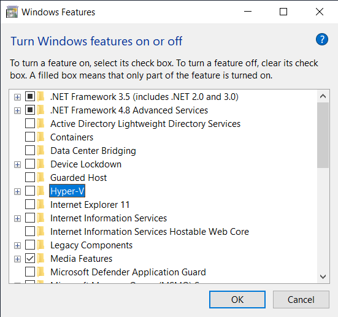
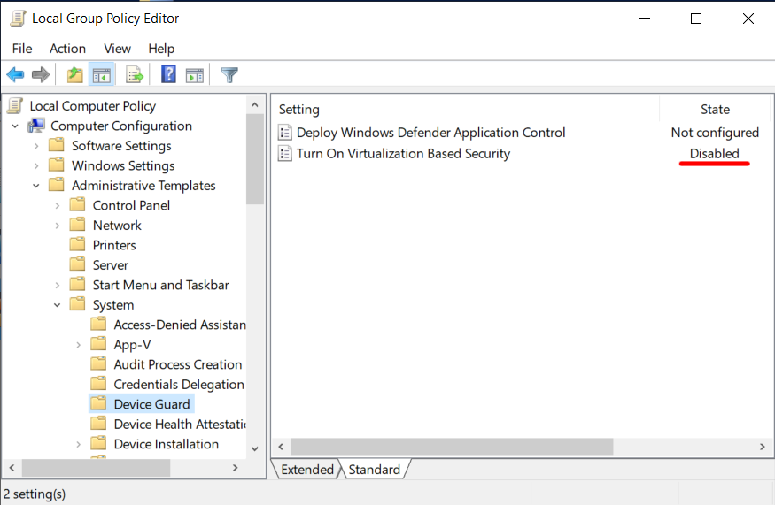
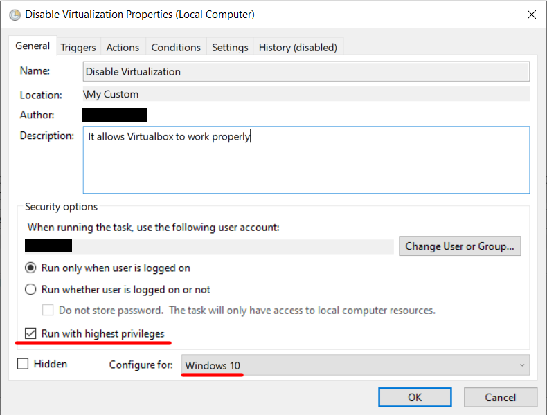
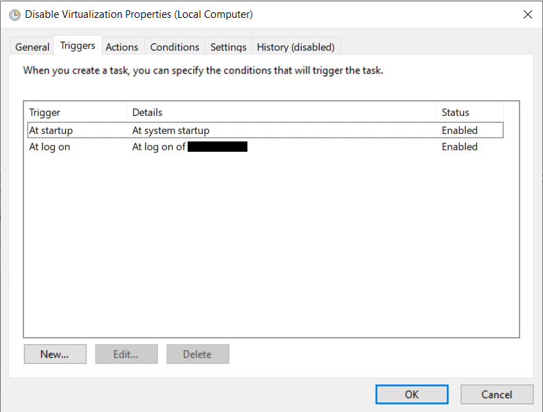
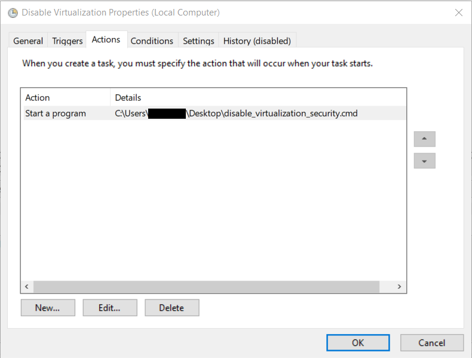

If your virtual machine hosted on Windows is slow or doesn't start at all, 
then this article is for you.

Most of the time I work on a virtual machine with Linux system. 
Some time ago I reinstalled my host Windows system and had to set up the 
virtual machine from scratch. Unfortunately, newer versions of Windows 
and my company group policy caused a lot of problems.

## Symptoms

If you see a green turtle icon in the lower right corner 
of the virtual machine window, it means that your virtual 
machine is running in slow mode.

The correct icon, indicating that `VT-x/AMD-V` support is in use, 
is the letter `V` on a blue background/chip 


## The Root Cause


## Solution

Below are the steps I had to follow to get everything working.  
Hopefully they will help you too.

***Note:** It is recommended to back up your data and to create 
system restore points, before changing anything!*

### Disable Incompatible Windows Features

Go to `Turn Windows features on or off` - you can search that from start menu, 
or find it in `Control Panel`.

Disable (untick) following services:
- Containers
- Guarded Host
- Hyper-V
- Virtual Machine Platform
- Windows Hypervisor Platform
- Windows Sandbox
- Windows Subsystem for Linux



### Disable Hypervisor

Start `Command Prompt` as administrator and run:

   ``` shell
   bcdedit /set hypervisorlaunchtype off
   ```

### Turn off Virtualization-Based Security

1. Start `Edit group policy` - `gpedit`
2. Go to `Local Computer Policy` > `Computer Configuration` > `Administrative Templates` > `System`
3. Click on `Device Guard`
4. Set `Turn On Virtualization Based Security` to state `Disabled`

   

5. Close `Group Policy Editor`
6. Start `Command Prompt` as administrator and run:

    ```shell
    bcdedit /set {0cb3b571-2f2e-4343-a879-d86a476d7215} loadoptions DISABLE-LSA-ISO,DISABLE-VBS
    bcdedit /set vsmlaunchtype off
    ```

### Disable Windows Defender Credential Guard

1. Start `Command Prompt` as administrator and run:

    ```shell
    reg delete "HKLM\SYSTEM\CurrentControlSet\Control\Lsa" /v "LsaCfgFlags" /f
    reg delete "HKLM\SOFTWARE\Policies\Microsoft\Windows\DeviceGuard" /v "LsaCfgFlags"  /f
    reg delete "HKLM\SOFTWARE\Policies\Microsoft\Windows\DeviceGuard" /v "EnableVirtualizationBasedSecurity" /f
    reg delete "HKLM\SOFTWARE\Policies\Microsoft\Windows\DeviceGuard" /v "RequirePlatformSecurityFeatures" /f
    
    mountvol X: /s
    copy %WINDIR%\System32\SecConfig.efi X:\EFI\Microsoft\Boot\SecConfig.efi /Y
    bcdedit /create {0cb3b571-2f2e-4343-a879-d86a476d7215} /d "DebugTool" /application osloader
    bcdedit /set {0cb3b571-2f2e-4343-a879-d86a476d7215} path "\EFI\Microsoft\Boot\SecConfig.efi"
    bcdedit /set {bootmgr} bootsequence {0cb3b571-2f2e-4343-a879-d86a476d7215}
    bcdedit /set {0cb3b571-2f2e-4343-a879-d86a476d7215} loadoptions DISABLE-LSA-ISO
    bcdedit /set {0cb3b571-2f2e-4343-a879-d86a476d7215} device partition=X:
    mountvol X: /d
    ```

### Restart PC and confirm changes

After a reboot, before the system boots, you will be asked 
whether to disable `Windows Defender Credential Guard` and 
`Virtualization-Based Security`. 

<u>*You must confirm everything with the Windows button.*</u>

### Set up script to fix things after each reboot (optional)

Unfortunately, after several reboots, my settings would reset and the problem would return. 
I suspect this is due to the fact that my computer is connected to a corporate domain 
and it updates the group policy from time to time.

My solution was to save the following script to a `.cmd` file 
and set it to run (as admin) every time the computer starts up.

Download the file: [disable_annoying_features.cmd](./files/disable_annoying_features.cmd)
```
reg delete "HKLM\SYSTEM\CurrentControlSet\Control\Lsa" /v "LsaCfgFlags" /f
reg delete "HKLM\SOFTWARE\Policies\Microsoft\Windows\DeviceGuard" /v "LsaCfgFlags"  /f
reg delete "HKLM\SOFTWARE\Policies\Microsoft\Windows\DeviceGuard" /v "EnableVirtualizationBasedSecurity" /f
reg delete "HKLM\SOFTWARE\Policies\Microsoft\Windows\DeviceGuard" /v "RequirePlatformSecurityFeatures" /f

mountvol X: /s
copy %WINDIR%\System32\SecConfig.efi X:\EFI\Microsoft\Boot\SecConfig.efi /Y
bcdedit /create {0cb3b571-2f2e-4343-a879-d86a476d7215} /d "DebugTool" /application osloader
bcdedit /set {0cb3b571-2f2e-4343-a879-d86a476d7215} path "\EFI\Microsoft\Boot\SecConfig.efi"
bcdedit /set {bootmgr} bootsequence {0cb3b571-2f2e-4343-a879-d86a476d7215}
bcdedit /set {0cb3b571-2f2e-4343-a879-d86a476d7215} loadoptions DISABLE-LSA-ISO
bcdedit /set {0cb3b571-2f2e-4343-a879-d86a476d7215} device partition=X:
mountvol X: /d

bcdedit /set {0cb3b571-2f2e-4343-a879-d86a476d7215} loadoptions DISABLE-LSA-ISO,DISABLE-VBS
bcdedit /set vsmlaunchtype off
```

#### How To Create the Task?

1. Run `Task Scheduler` - `taskschd.msc`
2. In the left pane click on `Task Scheduler Library` and then click `New Folder...`
3. Type some name, for example: `My Tasks`
4. Click on the new folder and choose `Create Task...`
5. Under the `General` tab, type in some name for the task, for example: `Fix Virtualbox`
6. At the bottom tick `Run with highest privileges` and change `Configure for` to `Windows 10`
   
   
   
7. Under `Triggers` tab, add two triggers: `At startup` and `At log on`

   

8. Under `Actions` tab, click `New...`, then choose action type `Start a program` and provide the path to the script with `Browse...` button

   

9. Save the task and exit

The disadvantage of this solution is that I have to confirm 
that I want to disable the features with the Windows button 
every time I turn on the computer. But at least everything works fine.

## References:

[VMware Workstation and Device/Credential Guard are not compatible](https://kb.vmware.com/s/article/2146361)  
[Disable Windows Defender Credential Guard](https://docs.microsoft.com/en-us/windows/security/identity-protection/credential-guard/credential-guard-manage#disable-windows-defender-credential-guard)  
[Task - Create to Run a Program at Startup and Log On](https://www.sevenforums.com/tutorials/67503-task-create-run-program-startup-log.html)